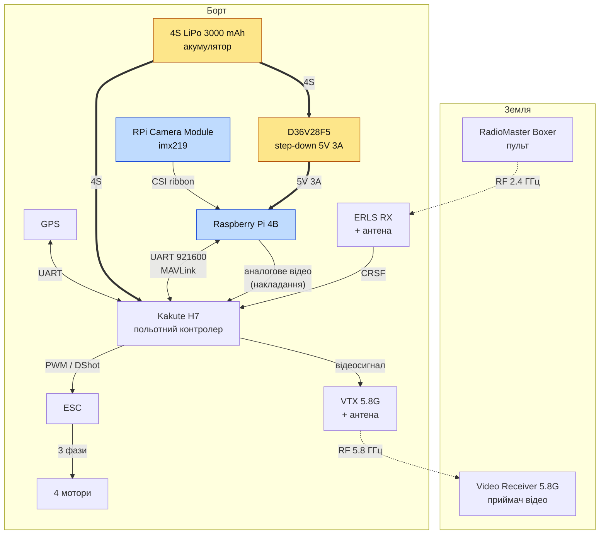

# Наявне обладнання

## Схема підключень зібраного дрона

Через дрон проходять два окремі контури:

- **Контур керування.** Камера по CSI віддає кадри на Raspberry Pi, той веде ціль і надсилає
  команди швидкості й курсу по UART як MAVLink у польотний контролер. Це шлях, який описують
  [README.md](README.md) і [docs/VISION.md](docs/VISION.md).
- **Контур відео.** Raspberry Pi малює накладання (зона захоплення, рамка цілі, стан) у фреймбуфер і
  віддає аналоговий сигнал на вхід камери польотного контролера, звідки він іде у VTX і далі на
  наземний приймач. Саме тому пілот бачить те саме, що бачить трекер — `vision.framebuffer` і
  `vision.overlay_fps` у `follow.json` керують цим контуром.

Живлення: обидва споживачі йдуть від одного 4S-акумулятора, але Raspberry Pi — через понижувальний
перетворювач D36V28F5 (5 В, 3 А), а не напряму.

## Перелік обладнання

| Component | Quantity | Info |
| --- | --- | --- |
| RPI5 | 1 | Raspberry Pi 5 8Gb |
| RPI4B | 1 | Raspberry Pi 4B 2Gb |
| RPI4 Zero 2W | 1 | Raspberry Pi Zero 2W |
| Orange PI5 | 1 | Orange Pi 5 8Gb + NPU |
| Radxa Zero | 1 | Radxa Zero 3W |
| SpeedyBee F4 | 1 | SpeedyBee F4 v3 |
| SpeedyBee H7 | 1 | SpeedyBee H7 v3 |
| Kakute H7 | 1 | Holybro Kakute H7 |
| ESP32 | 4 | ESP32 DevKit |
| SN65HVD230 | 5 | |
| BMP388 | 2 | Barometer |
| MPU9250 | 1 | |
| D36V28F5 | 1 | |
| MG996R | 4 | |
| GPS | 2 | |
| MCP2515 | 4 | |
| Hailo 8l | 1 | HAT M.2 module |
| ERLS RX | 1 | |
| Radiomaster Boxer | 1 | |
| VTX 5.8G | 1 | |
| RunCam camera | 2 | |
| Video Receiver 5.8G | 1 | |
| Google Coral | 1 | |
