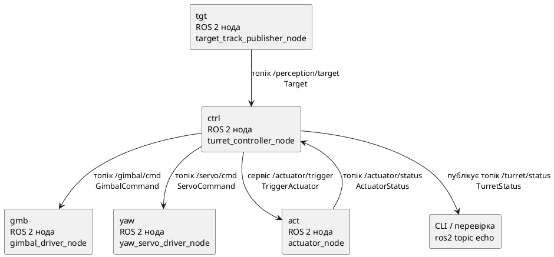
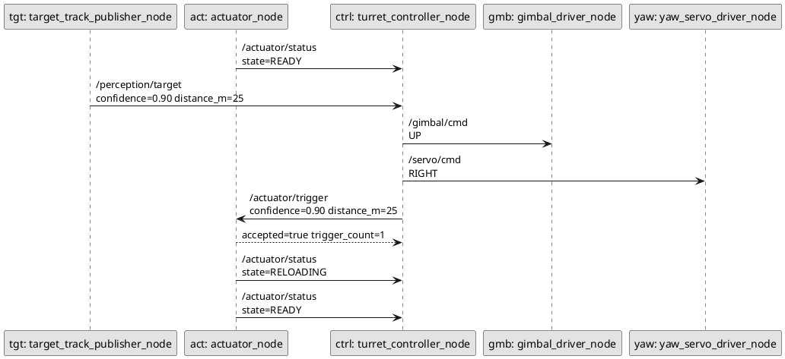

# ДЗ 13: ROS 2 система antidrone-turret

## Мета

Розробити маленьку ROS 2 систему на C++20 для спрощеного сценарію протидії
малому FPV-дрону. Одна нода читає файл з треком цілі та публікує багато
повідомлень: координати в кадрі, дистанцію і оцінку надійності розпізнавання
цілі. Контролер турелі має навести гімбал і серво, а коли в потоці настає
потрібний момент - надіслати актуатору команду пострілу через сервіс
`/actuator/trigger`.

У цьому ДЗ вже надано стартовий пакет `antidrone_turret`:

- власні `.msg` і `.srv` типи;
- `target_track_publisher_node`;
- `actuator_node`;
- YAML-файл;
- launch-файл, який запускає готові ноди;
- тест для наданої стартової логіки.

Готовий `actuator_node` не керує реальним обладнанням, але поводиться як
невеликий драйвер: приймає команду пострілу через сервіс, рахує кількість
прийнятих команд і публікує стан `READY` або `RELOADING`.

Трек продовжує публікуватися під час перезаряджання. Студентський алгоритм
має бачити `RELOADING` і не запитувати постріл повторно, доки актуатор не
повернеться у `READY`.

Потрібно самостійно дописати контролер, ноди драйверів наведення, окрему
C++ логіку, тести, CMake targets і записи у launch-файл.

---

## Система, яку потрібно отримати

У component diagram у першому рядку прямокутника вказана коротка псевдо-назва
інстансу, у другому - реальна назва ROS 2 ноди.



Послідовність:

У sequence diagram зліва від двокрапки вказана коротка псевдо-назва
інстансу, справа - назва ROS 2 ноди.



---

## Ролі гімбала, серво і актуатора

У цьому ДЗ гімбал і yaw-серво - це дві частини наведення турелі, а актуатор -
окремий вузол для пострілу:

- `gimbal_driver_node` відповідає за вертикальне наведення. У цьому спрощенні
  гімбал - це вузол, який піднімає, опускає або втримує лінію наведення. Нода
  отримує `GimbalCommand`: `UP`, `DOWN`, `CENTER`;
- `yaw_servo_driver_node` відповідає за горизонтальний поворот турелі.
  Yaw-серво - це сервопривід повороту навколо вертикальної осі. Нода отримує
  `ServoCommand`: `LEFT`, `RIGHT`, `CENTER`;
- `actuator_node` не займається наведенням. Він відповідає тільки за команду
  пострілу через сервіс `/actuator/trigger` і за стан `READY` або
  `RELOADING`.

Актуатор потрібно сприймати як корисне навантаження, закріплене на тій самій
лінії наведення. Це може бути умовний сіткостріл або інший виконавчий модуль:
куди гімбал і yaw-серво навели центр турелі, туди "дивиться" актуатор.

Тобто контролер спочатку вирішує, куди навести турель, а команду пострілу
надсилає окремо і тільки тоді, коли ціль достатньо близько, розпізнавання
достатньо надійне, а актуатор має стан `READY`. У цьому ДЗ не потрібно
моделювати фізику пострілу або реальне обладнання.

---

## Готові файли

```text
homework_13/
  robot_ws/
    src/
      antidrone_turret/
        package.xml
        CMakeLists.txt
        msg/
          Target.msg
          ActuatorStatus.msg
        srv/
          TriggerActuator.srv
        include/
          antidrone_turret/
            target_sequence.hpp
            target_track_loader.hpp
            target_track_simulation.hpp
            actuator_model.hpp
        src/
          target_track_publisher_node.cpp
          actuator_node.cpp
        test/
          provided_logic_test.cpp
        tracks/
          approach_trigger.csv
          far_flyby_no_trigger.csv
          low_confidence_no_trigger.csv
          reload_pressure.csv
        config/
          sequence.yaml
        launch/
          system.launch.py
```

Готовий `system.launch.py` запускає тільки:

- `target_track_publisher_node`;
- `actuator_node`.

Готовий тест `test/provided_logic_test.cpp` перевіряє тільки надану стартову
логіку:

- читання CSV-треку;
- валідність усіх наданих CSV-треків;
- послідовність повідомлень цілі;
- допоміжну логіку публікації треку;
- перехід актуатора `READY` -> `RELOADING` -> `READY`;
- відхилення повторної команди пострілу під час `RELOADING`.

---

## Що потрібно дописати

Потрібно розширити наданий пакет `antidrone_turret`, а не створювати новий
пакет. Конкретні назви `.cpp` і `.hpp` файлів можна обрати самостійно.

`turret_controller_node`, `gimbal_driver_node` і `yaw_servo_driver_node` у
стартовому коді не надаються. Їх потрібно реалізувати самостійно. Готові ноди
`target_track_publisher_node` і `actuator_node` тільки дають вхідний потік
цілей, сервіс пострілу і статус актуатора.

Обов'язкові частини рішення:

- реалізувати ноду `turret_controller_node`;
- реалізувати ноду `gimbal_driver_node`;
- реалізувати ноду `yaw_servo_driver_node`;
- `msg/GimbalCommand.msg`;
- `msg/ServoCommand.msg`;
- `msg/TurretStatus.msg`;
- окрема C++ логіка контролера турелі без `rclcpp`;
- мінімальні тести для власної логіки контролера: хоча б один тест на кожну
  частину рішення;
- CMake targets для нових виконуваних файлів і тестів;
- записи для нових нод у `launch/system.launch.py`;
- YAML-параметри для `turret_controller_node`.

У `CMakeLists.txt` потрібно користуватися `ament_auto`, як у стартовому пакеті
і прикладах з `repository/demos/lesson_5_4`.

---

## Надані типи

```text
# msg/Target.msg
bool visible
float32 x
float32 y
float32 distance_m
float32 confidence
```

Поле `confidence` означає оцінку надійності розпізнавання цілі від `0.0` до
`1.0`. Чим більше значення, тим надійніше perception-модуль вважає, що в кадрі
саме FPV-ціль, а не фон, шум або інший об'єкт.

```text
# msg/ActuatorStatus.msg
uint8 READY=0
uint8 RELOADING=1

uint8 state
uint32 trigger_count
```

```text
# srv/TriggerActuator.srv
float32 confidence
float32 distance_m
---
bool accepted
uint32 trigger_count
```

## Типи, які потрібно додати

Ці `.msg` не надаються у стартовому пакеті. Їх потрібно створити самостійно,
додати у `rosidl_generate_interfaces(...)` і підключити до targets, які їх
використовують.

```text
# msg/GimbalCommand.msg
int8 DOWN=-1
int8 CENTER=0
int8 UP=1

int8 direction
float32 target_y
float32 error_y
```

```text
# msg/ServoCommand.msg
int8 LEFT=-1
int8 CENTER=0
int8 RIGHT=1

int8 direction
float32 target_x
float32 error_x
```

```text
# msg/TurretStatus.msg
uint8 TARGET_NONE=0
uint8 TARGET_LOW_CONFIDENCE=1
uint8 TARGET_LOCKED=2

uint8 ACTION_IDLE=0
uint8 ACTION_TRACK=1

uint8 TRIGGER_SKIP=0
uint8 TRIGGER_REQUESTED=1
uint8 TRIGGER_RELOADING=2

uint8 target_state
uint8 action
uint8 trigger_state
float32 confidence
float32 distance_m
```

### Контракт команд наведення

`Target.x` і `Target.y` - це координати центру цілі в кадрі. У цьому ДЗ
використовується спрощена модель кадру:

```text
ширина кадру:  640
висота кадру:  480
центр кадру:   x=320, y=240

x росте праворуч
y росте вниз
```

`turret_controller_node` має перетворити координати цілі на дві окремі
команди наведення:

- `/servo/cmd` керує горизонтальним поворотом турелі;
- `/gimbal/cmd` керує вертикальним наведенням.

Поля `ServoCommand`:

- `target_x` - скопійоване значення `Target.x`;
- `error_x = Target.x - 320.0`;
- `direction=RIGHT`, якщо `error_x > 0`;
- `direction=LEFT`, якщо `error_x < 0`;
- `direction=CENTER`, якщо `error_x == 0`.

Поля `GimbalCommand`:

- `target_y` - скопійоване значення `Target.y`;
- `error_y = 240.0 - Target.y`;
- `direction=UP`, якщо `error_y > 0`;
- `direction=DOWN`, якщо `error_y < 0`;
- `direction=CENTER`, якщо `error_y == 0`.

Чому `error_y` рахується як `240.0 - Target.y`: у координатах кадру `y`
росте вниз, тому ціль вище центру має менше `y`, але для команди гімбала це
означає рух `UP`.

`gimbal_driver_node` і `yaw_servo_driver_node` у цьому ДЗ не керують реальним
залізом. Вони мають підписатися на свої топіки, отримати типізовану команду і
залогоувати, що команда дійшла. Наприклад:

```text
gimbal_driver_node отримав: direction=UP target_y=180 error_y=60
yaw_servo_driver_node отримав: direction=RIGHT target_x=420 error_x=100
```

Якщо ціль не видима або розпізнавання недостатньо надійне, нові команди
`/gimbal/cmd` і `/servo/cmd` публікувати не потрібно. У такому випадку
`TurretStatus.action` має бути `ACTION_IDLE`.

Runtime-контракти:

```text
/perception/target    antidrone_turret/msg/Target
/turret/status        antidrone_turret/msg/TurretStatus
/gimbal/cmd           antidrone_turret/msg/GimbalCommand
/servo/cmd            antidrone_turret/msg/ServoCommand
/actuator/status      antidrone_turret/msg/ActuatorStatus
/actuator/trigger     antidrone_turret/srv/TriggerActuator
```

---

## Готові ноди

`target_track_publisher_node` читає CSV-трек і публікує кожен рядок як
`Target.msg`. Якщо launch запускається без `track:=...`, використовується
`track:=all`: усі готові треки йдуть послідовно від `approach_trigger.csv`
до `reload_pressure.csv`. Між епізодами є рядок `visible=false`.

За замовчуванням послідовність повторюється циклом, тобто повідомлення
продовжують приходити навіть після команди пострілу або під час `RELOADING`.

Формат CSV:

```text
visible,x,y,distance_m,confidence
true,320,240,70,0.70
true,340,230,55,0.82
```

Готові треки:

- `approach_trigger.csv` - FPV підлітає до турелі; має з'явитися момент для
  команди пострілу через `/actuator/trigger`;
- `far_flyby_no_trigger.csv` - FPV розпізнається з достатньою оцінкою
  надійності, але не заходить у робочу дистанцію;
- `low_confidence_no_trigger.csv` - FPV близько, але оцінка надійності
  розпізнавання завжди нижче `0.80`, тобто нижче 80%;
- `reload_pressure.csv` - два близькі епізоди підряд: перший може витратити
  постріл, а наступний FPV доходить до захищеної зони, поки актуатор ще у
  `RELOADING`. У файлі це видно по другому близькому епізоду, де дистанція
  доходить до `distance_m=7`.

Параметри `target_track_publisher_node`:

- `publish_hz`;
- `repeat_sequence`;
- `track_file` - передається launch-файлом, напряму в YAML міняти не потрібно.

Launch-аргумент `track` обирає набір або окремий файл:

```bash
ros2 launch antidrone_turret system.launch.py
ros2 launch antidrone_turret system.launch.py track:=approach_trigger.csv
ros2 launch antidrone_turret system.launch.py track:=far_flyby_no_trigger.csv
ros2 launch antidrone_turret system.launch.py track:=low_confidence_no_trigger.csv
ros2 launch antidrone_turret system.launch.py track:=reload_pressure.csv
```

Перший запуск без `track:=...` еквівалентний `track:=all`.

### Можливі сценарії роботи турелі

Трек потрібно сприймати як невеликий епізод: один FPV з'являється у полі
зору, рухається від кадру до кадру, може наближатися до турелі або пролітати
повз. Рядок з `visible=false` означає паузу між епізодами або втрату цілі.

У ДЗ можливі такі сценарії:

- дальній проліт: ціль видима і має достатню оцінку надійності
  розпізнавання, тому турель має наводити гімбал і серво, але сервіс
  пострілу `/actuator/trigger` не викликається, бо
  `distance_m > max_distance_m`;
- ненадійне розпізнавання: ціль близько, але оцінка надійності розпізнавання
  нижче `confidence_threshold`. За замовчуванням це `0.80`, тобто нижче 80%.
  У цьому випадку контролер має перейти в `TARGET_LOW_CONFIDENCE`, не рухати
  наведення і не запитувати постріл;
- вдалий момент для пострілу: ціль видима, оцінка надійності розпізнавання
  достатня, `distance_m <= max_distance_m`, актуатор у стані `READY`;
  контролер має навести гімбал і серво, опублікувати статус і один раз
  викликати сервіс пострілу;
- перезаряджання: після прийнятої команди пострілу актуатор публікує
  `RELOADING`;
  поки цей стан активний, близька ціль може продовжувати приходити у
  `/perception/target`, але повторну команду пострілу викликати не потрібно;
- наступний епізод: після вдалого пострілу або після завершення поточного
  епізоду трек може перейти до наступної цілі, тому контролер має працювати
  як потокова система і не покладатися на одноразовий запуск;
- запізнілий запит пострілу: якщо близька ціль приходить під час
  `RELOADING`, її потрібно позначити як `TRIGGER_RELOADING`; це демонструє,
  що правильна поведінка системи залежить не тільки від дистанції і оцінки
  надійності розпізнавання, а й від останнього стану актуатора;
- тиск на перезаряджання: в `reload_pressure.csv` перший близький FPV може
  отримати постріл, але наступний FPV підлітає, поки актуатор ще не готовий.
  Контролер не має робити повторний запит пострілу під час `RELOADING`.

`actuator_node`:

- є навчальною реалізацією драйвера актуатора без логіки, прив'язаної до
  конкретного обладнання;
- на старті публікує `/actuator/status` зі `state=READY`;
- має сервіс `/actuator/trigger`;
- після прийнятої команди пострілу повертає відповідь сервісу;
- після прийнятої команди пострілу публікує `/actuator/status` зі
  `state=RELOADING`;
- після `reload_ms` публікує `/actuator/status` зі `state=READY`.

Параметри `actuator_node`:

- `reload_ms`;
- `status_publish_hz`.

Готові `target_track_publisher_node` і `actuator_node` показують розділення:
ROS 2 нода відповідає за параметри, топіки, сервіс і таймери.
`TargetTrackSimulation` і `ActuatorModel` не залежать від `rclcpp` і тримають
звичайну C++ логіку.

Для цієї наданої логіки вже є `test/provided_logic_test.cpp`. Його не потрібно
видаляти або переписувати. Нові тести мають додаватися поруч і перевіряти
саме логіку контролера турелі.

---

## Логіка, яку потрібно реалізувати

Логіка ухвалення рішення не має бути пов'язана з ROS 2. У ній не має бути
`rclcpp`, publisher, subscriber, клієнт сервісу або `Node`. ROS-нода має
тільки читати повідомлення, викликати чисту C++ логіку і перекладати результат
у ROS 2 повідомлення або запит сервісу.

У чистій C++ логіці потрібно виділити щонайменше такі частини:

- оцінка цілі: `visible`, `confidence_threshold` -> `TARGET_NONE`,
  `TARGET_LOW_CONFIDENCE` або `TARGET_LOCKED`;
- команда yaw-серво: `Target.x` -> `ServoCommand.direction`, `target_x`,
  `error_x`;
- команда гімбала: `Target.y` -> `GimbalCommand.direction`, `target_y`,
  `error_y`;
- рішення щодо пострілу: `distance_m`, `max_distance_m`,
  останній `ActuatorStatus.state` -> `TRIGGER_SKIP`, `TRIGGER_REQUESTED` або
  `TRIGGER_RELOADING`;
- складання `TurretStatus` для перевірки через `/turret/status`.

Приклад такого розділення є у
`repository/demos/lesson_5_4/06_logic_split`. Всередині package
`logic_split_demo` чистий C++ код лежить у
`include/logic_split_demo/target_decision.hpp`, тести для нього лежать у
`test/target_decision_test.cpp`, а ROS 2 wrapper-нода лежить окремо в
`src/decision_node.cpp`. Чистий C++ код не включає `rclcpp`.

Параметри `turret_controller_node`:

- `confidence_threshold=0.80`;
- `max_distance_m=30.0`.

`confidence_threshold=0.80` означає, що значення `confidence` від `0.80` і
вище вважається достатньо надійним розпізнаванням. Значення нижче `0.80`
потрібно трактувати як `TARGET_LOW_CONFIDENCE`.

`TurretStatus` потрібен не для дублювання логів, а для перевірки рішення
контролера через `ros2 topic echo /turret/status`. Його публікує
`turret_controller_node` після обробки кожного нового повідомлення
`/perception/target`.

Поля статусу:

- `target_state` описує якість цілі:
  - `TARGET_NONE` - ціль не видима;
  - `TARGET_LOW_CONFIDENCE` - ціль є, але `confidence < confidence_threshold`.
    За default-порогом `0.80` це менше 80%;
  - `TARGET_LOCKED` - ціль видима і розпізнавання достатньо надійне.
- `action` описує, чи треба рухати наведення:
  - `ACTION_IDLE` - не публікувати нові команди наведення, бо ціль не придатна;
  - `ACTION_TRACK` - публікувати `GimbalCommand` і `ServoCommand`.
- `trigger_state` описує рішення щодо команди пострілу через
  `/actuator/trigger`:
  - `TRIGGER_SKIP` - не викликати сервіс пострілу;
  - `TRIGGER_REQUESTED` - викликати сервіс пострілу, бо ціль близько і
    актуатор готовий;
  - `TRIGGER_RELOADING` - ціль близько, але актуатор ще перезаряджається.

Правила для кожного нового повідомлення `/perception/target`:

- `visible=false` -> `TARGET_NONE`, `ACTION_IDLE`, `TRIGGER_SKIP`;
- оцінка надійності розпізнавання нижче порога
  (`confidence < confidence_threshold`) -> `TARGET_LOW_CONFIDENCE`,
  `ACTION_IDLE`, `TRIGGER_SKIP`;
- коректна ціль -> опублікувати `GimbalCommand`, `ServoCommand`, `TurretStatus`;
- `distance_m <= max_distance_m` і актуатор `READY` -> викликати
  `/actuator/trigger`, встановити `TRIGGER_REQUESTED`;
- `distance_m <= max_distance_m` і актуатор `RELOADING` -> сервіс пострілу
  не викликається, встановити `TRIGGER_RELOADING`;
- `distance_m > max_distance_m` -> `TRIGGER_SKIP`.

Правила вибору напрямку:

- `x > 320` -> `ServoCommand.direction=RIGHT`;
- `x < 320` -> `ServoCommand.direction=LEFT`;
- `x == 320` -> `ServoCommand.direction=CENTER`;
- `y < 240` -> `GimbalCommand.direction=UP`;
- `y > 240` -> `GimbalCommand.direction=DOWN`;
- `y == 240` -> `GimbalCommand.direction=CENTER`.

Очікувані рішення для готових треків:

```text
approach_trigger.csv:
  коли distance_m <= 30 і confidence >= 0.80:
    розпізнавання достатньо надійне
    READY -> TRIGGER_REQUESTED

far_flyby_no_trigger.csv:
  distance_m завжди > 30:
    TRIGGER_SKIP

low_confidence_no_trigger.csv:
  confidence завжди < 0.80, тобто нижче 80%:
    розпізнавання недостатньо надійне
    ACTION_IDLE, TRIGGER_SKIP

reload_pressure.csv:
  перший близький кадр із надійним розпізнаванням:
    READY -> TRIGGER_REQUESTED
  наступний близький FPV приходить, поки актуатор у RELOADING:
    RELOADING -> TRIGGER_RELOADING
  якщо FPV доходить до захищеної зони до READY:
    повторний постріл заборонений, епізод вважається пропущеним
```

---

## Що потрібно перевірити

### 1. Збірка і тести

```bash
source /opt/ros/jazzy/setup.bash
cd homework_13/robot_ws
colcon build --symlink-install --packages-select antidrone_turret
source install/setup.bash
colcon test --packages-select antidrone_turret
colcon test-result --verbose
```

У стартовому пакеті вже є тести для наданої логіки. Для власної логіки
контролера потрібно додати мінімальні тести: хоча б один тест на кожну
частину рішення.

```text
оцінка цілі:
  confidence нижче порога -> ACTION_IDLE, TRIGGER_SKIP

команда yaw-серво:
  x > 320 -> ServoCommand RIGHT, error_x > 0

команда гімбала:
  y < 240 -> GimbalCommand UP, error_y > 0

рішення щодо пострілу:
  близька ціль + актуатор READY -> TRIGGER_REQUESTED
  близька ціль + актуатор RELOADING -> TRIGGER_RELOADING

статус контролера:
  далека коректна ціль -> TARGET_LOCKED, ACTION_TRACK, TRIGGER_SKIP
```

### 2. Перевірка під час роботи

```bash
ros2 launch antidrone_turret system.launch.py
ros2 topic echo /perception/target --once
ros2 topic echo /turret/status --once
ros2 topic echo /gimbal/cmd --once
ros2 topic echo /servo/cmd --once
ros2 topic echo /actuator/status --once
```

Запуск без `track:=...` проганяє всі готові треки послідовно. Окремо можна
запустити кожен трек:

```bash
ros2 launch antidrone_turret system.launch.py track:=approach_trigger.csv
ros2 launch antidrone_turret system.launch.py track:=far_flyby_no_trigger.csv
ros2 launch antidrone_turret system.launch.py track:=low_confidence_no_trigger.csv
ros2 launch antidrone_turret system.launch.py track:=reload_pressure.csv
```

Якщо потрібно більше діагностичних повідомлень, можна змінити рівень логів
під час запуску:

```bash
ros2 launch antidrone_turret system.launch.py track:=reload_pressure.csv log_level:=debug
```

За замовчуванням використовується `log_level:=info`. Для діагностики корисні
`debug`, `info`, `warn`, `error`. У нормальній перевірці ДЗ не потрібно
покладатися на debug-логи: очікувану поведінку мають доводити топіки, сервіс,
граф ROS 2 і модульні тести.

Для `reload_pressure.csv` рівень `debug` може показати діагностичне
повідомлення симулятора про те, що FPV дійшов до захищеної зони, поки
актуатор був у `RELOADING`. Основний критерій для студентського рішення все
одно лишається через топіки і сервіс: під час `RELOADING` повторний сервіс
пострілу не викликається.

Очікування:

- `/perception/target` має тип `antidrone_turret/msg/Target`;
- `/turret/status` має тип `antidrone_turret/msg/TurretStatus`;
- `/gimbal/cmd` має тип `antidrone_turret/msg/GimbalCommand`;
- `/servo/cmd` має тип `antidrone_turret/msg/ServoCommand`;
- `/actuator/status` має тип `antidrone_turret/msg/ActuatorStatus`.

### 3. Сервіс

```bash
ros2 service call /actuator/trigger antidrone_turret/srv/TriggerActuator "{confidence: 0.9, distance_m: 25.0}"
ros2 topic echo /actuator/status --once
```

Очікування:

```text
accepted: true
trigger_count: 1
```

Після прийнятої команди пострілу `/actuator/status` має перейти у
`RELOADING`, а після `reload_ms` повернутись у `READY`.

### 4. Graph

```bash
ros2 node list
ros2 topic list
ros2 service list
ros2 param list
```

Очікувані ноди:

```text
/target_track_publisher_node
/actuator_node
/turret_controller_node
/gimbal_driver_node
/yaw_servo_driver_node
```

Очікувані топіки:

```text
/perception/target
/turret/status
/gimbal/cmd
/servo/cmd
/actuator/status
```

Очікуваний сервіс:

```text
/actuator/trigger
```

---

## Формат здачі

Здається посилання на власний GitHub-репозиторій або PR.

У README рішення мають бути:

- короткий опис реалізованої системи;
- PlantUML або текстова схема нод, топіків і сервісу;
- команди build/test;
- команда запуску;
- фактичний результат `ros2 topic echo /turret/status --once`;
- фактичний результат `ros2 topic echo /gimbal/cmd --once`;
- фактичний результат `ros2 topic echo /servo/cmd --once`;
- фактичний результат `ros2 topic echo /actuator/status --once`;
- висновок, чи команда пострілу через актуатор викликається тільки при
  `READY`.
